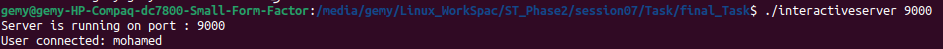
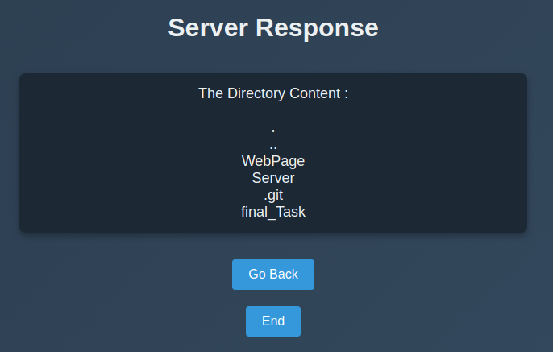
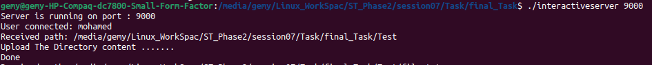
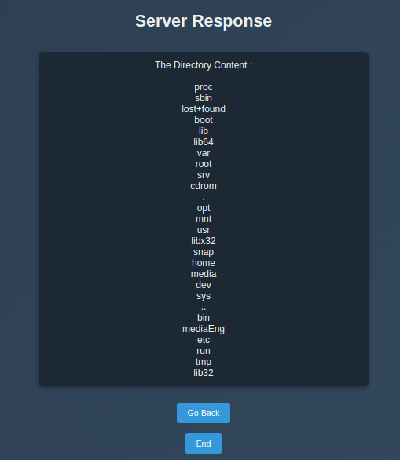
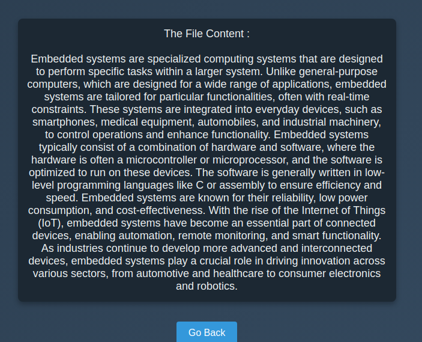
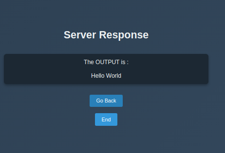

### README.md

# HTTP Server Project

## Project Overview

This project implements an HTTP server in C that processes requests from a web browser. The server supports directory listing, file reading, CGI script execution, and proper error handling. The application has three web pages that interact with the user through a simple and dynamic interface.

### Features
1. Accept connections from web browsers.
2. Read and parse incoming HTTP requests.
3. Process requests based on resource type:
   - **Directory**: Lists its contents.
   - **Regular File**: Displays the file's contents.
   - **CGI Script**: Executes the script and returns its output.
   - **Non-Existent Resource**: Sends a proper HTTP error message.
4. Construct and send responses to the client.
5. Support for concurrent access.

---

## How It Works

1. **Start the Server**:
   - Run the server with a specified port. For example:
     ```bash
     ./server 9000
     ```
   - The server starts listening for HTTP connections on the specified port.

2. **Page 1: Welcome and User Input**:
   - When the user opens the browser and navigates to `http://<ip>:<port>`, Page 1 is displayed.

   - This page prompts the user to enter their name.



   - After submitting, the server logs the name and navigates to Page 2.


3. **Page 2: Path Input**:
   - Page 2 allows the user to input a file or directory path.
   - The server logs the input path and processes it according to its type:
     - **Directory**: Lists its contents.
     - **Regular File**: Reads and displays the file content.
     - **CGI Script**: Executes and shows the output.


4. **Page 3: Display Results**:
   - Page 3 displays the result based on the input path (e.g., directory listing, file content, CGI output, or an error message).
   - This page includes two options:
     - **Search Again**: Returns to Page 2.
     - **End Connection**: Navigates back to Page 1.





---

## Code Structure

### Files
1. **interactiveserver.c**: Entry point of the program. Handles server initialization and main loop.
2. **server.c**: Implements core server functionality, including creating the socket, handling clients, and processing paths.
3. **pages.c**: Contains functions to generate the three web pages (HTML content) dynamically.
4. **pages.h**: Header file for `pages.c` defining page-related functions and constants.
5. **server.h**: Header file for `server.c`, defining utility functions and constants.

---

## Setup Instructions

1. **Prerequisites**:
   - GCC compiler (to compile the server).
   - A modern web browser to access the web pages.

2. **Build the Server**:
   ```bash
   gcc -o interactiveserver interactiveserver.c server.c pages.c server.h pages.h
   ```

3. **Run the Server**:
   ```bash
   ./interactiveserver <port>
   ```
   Replace `<port>` with the desired port number (e.g., `9000`).

4. **Test the Server**:
   - Open a web browser and navigate to `http://<ip>:<port>`.

---

## Example Outputs

### Page 1: Directory Content 




### Page 2: Regular File Input




### Page 3: CGI Excute


---
``
