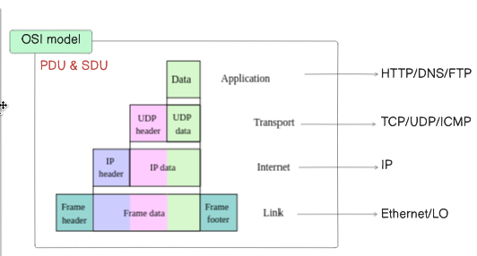

# Wirefish - A Packet Sniffer in C (Object-Oriented Design)

## 📌 Introduction
**Wirefish** is a packet sniffer written in **C**, following **Object-Oriented Programming (OOP) principles**. The project is designed to analyze network traffic, detecting and classifying different protocols at various layers of the **OSI model**. It supports key **Application, Transport, and Network Layer** protocols and provides structured data for each captured packet.

---
### **Protocol Data Unit (PDU) and Service Data Unit (SDU)**  
In networking, **PDU (Protocol Data Unit)** and **SDU (Service Data Unit)** are fundamental concepts used to describe how data is transmitted between different layers of the **OSI model**.

#### **1. Protocol Data Unit (PDU)**  
A **PDU** is the unit of data that a specific layer of the OSI model transmits to another system. Each layer has its own PDU format.  

| OSI Layer | PDU Name |
|-----------|---------|
| Application | Data |
| Transport | Segment (TCP) / Datagram (UDP) |
| Network | Packet |
| Data Link | Frame |

#### **2. Service Data Unit (SDU)**  
An **SDU** is the data received from the upper layer by a specific OSI layer. It includes raw data plus control information added by the upper layer. The SDU is then encapsulated into the PDU of the lower layer.

### **Relationship Between PDU and SDU**  
- The **SDU is passed from an upper layer to a lower layer**, where the lower layer adds its own header (encapsulation) and converts it into a **PDU**.  
- When data is transmitted over the network, each layer processes its corresponding **PDU** and extracts the **SDU** to pass it to the upper layer.

---

## **The OSI Model**
The **OSI (Open Systems Interconnection) model** is a conceptual framework that standardizes network communication into **7 layers**.  

### **OSI Layers and Their Functions**
1. **Data Link Layer** (Frames) → Ensures error-free data transfer between adjacent nodes (e.g., Ethernet, MAC addresses).
2. **Network Layer** (Packets) → Handles logical addressing and routing (e.g., IP).
3. **Transport Layer** (Segments) → Ensures end-to-end communication (e.g., TCP, UDP).
4. **Application Layer** → Provides user services (e.g., HTTP, FTP, DNS).

---

---

---
## 📚 Supported Protocols & OSI Model
Wirefish operates at multiple layers of the **OSI Model**:

| **OSI Layer**       | **Supported Protocols** |
|---------------------|------------------------|
| **Data Link Layer** | Ethernet, Loopback (lo) |
| **Network Layer**   | IP                      |
| **Transport Layer** | TCP, UDP, ICMP         |
| **Application Layer** | HTTP, FTP, DNS       |

### **Supported Protocols & Hierarchy**
- **IP** - The base protocol for network communication.
- **TCP, UDP, ICMP** - Transport layer protocols inheriting from IP.
- **DNS** - Inherits from UDP.
- **HTTP, FTP** - Inherit from TCP.

Each detected packet type contains the necessary encapsulated data:
- **HTTP** (Includes TCP & IP Data)
- **FTP** (Includes TCP & IP Data)
- **DNS** (Includes UDP & IP Data)
- **TCP** (Includes IP Data)
- **UDP** (Includes IP Data)
- **ICMP** (Includes IP Data)
- **IP** (Raw IP Data)

---


---

## 🎨 **Class Hierarchy (OOP in C)**

Below is the **class hierarchy** for Wirefish, showcasing **inheritance relationships**:

```plaintext
        ┌─────────┐
        │   IP    │
        └─────────┘
             ▲
 ┌───────────┴───────────┐
 │          │            │
 │         UDP          TCP
 │          │            │
 │         DNS         HTTP, FTP
 │
ICMP
```

**Explanation:**
- **IP** is the base class for all network layer packets.
- **TCP, UDP, ICMP** inherit from IP.
- **DNS** inherits from UDP.
- **HTTP, FTP** inherit from TCP.

---

---

## 🚀 Features
✔️ **Packet Sniffing**: Captures and analyzes network packets in real-time.  
✔️ **Protocol Detection**: Classifies packets into HTTP, FTP, DNS, TCP, UDP, ICMP, and IP.  
✔️ **OOP in C**: Implements an object-oriented approach using structs and function pointers.  
✔️ **Filtering**: Supports IP and port-based filtering.  


---

## 🛠️ Installation & Usage
### **1. Install Dependencies**
```sh
sudo apt install libpcap
```

### **2. Build the Project**
```sh
gcc -o wirefish sniffer.c IPclass.c TCPclass.c UDPclass.c FTPclass.c HTTPclass.c DNSclass.c ICMPclass.c -lpcap
```
### **3. Run the Packet Sniffer**
```sh
sudo ./wirefish <interface> [-ip <IP>] [-port <PORT>]
```
### **Example**
```sh
 sudo ./wirefish enp0s25 -ip 8.8.8.8 -port 80
```


## Dynamic Filtering (Ctrl+C Feature)

### When **Ctrl+C** (signal) is pressed, the program pauses, allowing modification of filters(IP,Port,Interface).
```sh
==================================
========= Sniffer Paused =========
==================================
Current Filters:
Interface: enp0s25
IP Filter: 8.8.8.8
Port Filter: None

Options:
1) Edit IP filter
2) Edit Port filter
3) Edit Interface
4) Reset filters
5) Resume sniffing
6) Exit

Enter choice:
```
Here Is the link for video for testing [WireFish In C ]
[Press here](https://drive.google.com/file/d/1yq-oMuAJXUwZTHCU7lnZeaccXeTkDXG3/view?usp=sharing)

---


