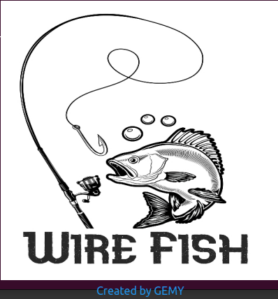

# Wirefish++ 

- Network Packet Sniffer (C++ with Qt GUI)**
🚀 **Wirefish++** is the next version of **Wirefish**, a network packet sniffer developed using **C++ and Object-Oriented Programming (OOP)** principles, integrated with a **Qt GUI**. It allows real-time packet capture, filtering, and analysis of various network protocols.

## **📌 Features**
✅ Supports multiple network protocols:  
- **Application Layer:** HTTP, FTP, DNS  
- **Transport Layer:** TCP, UDP, ICMP  
- **Network Layer:** IP  

✅ **Object-Oriented Design** with class-based protocol handling  
✅ **Graphical User Interface (Qt)** for real-time packet visualization  
✅ **Live packet filtering** by **IP and Port**  
✅ **Pause and resume functionality** to modify filters dynamically  
✅ **Displays structured packet data** in a user-friendly format  
---

---
Here Is the Link For Testing The Gui
[Part1](https://drive.google.com/file/d/1zBNVipk-jozzjX24La7GjXRPW35PNDi0/view?usp=sharing)
[Part2](https://drive.google.com/file/d/1zLxgf0VwvS4Z7eN633Ane9473kDMpVTH/view?usp=sharing)

---
Here Is the Repo For Part 1 [WireFish In C ]
🔗 **GitHub Repo:** [https://github.com/Mohamed100100/STMicroelectronics_Tasks_Phase2/tree/main/WireFish_In_C)
---

